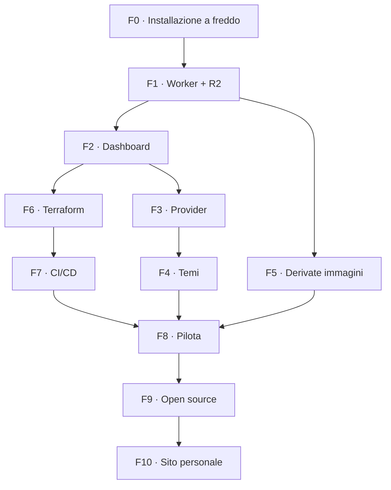

# Roadmap — PhotoPortfolio Template

**Data:** 20 settembre 2026
**Premessa:** vedi `docs/platform-direction.md`. Se una fase qui contraddice una decisione lì, vale il documento di direzione.
**Unità di stima:** una *sessione* = 2–4 ore di lavoro concentrato, come in `piano-implementazione.md`.

---

## 1. Obiettivo

Portare `PhotoPortfolioTemplate` da boilerplate Drive-based a template fotografico self-hosted che uno sviluppatore installa sul proprio account Cloudflare, consegna come sito funzionante e gestisce poi dalla dashboard.

Ogni fase lascia il repo in uno stato funzionante e dimostrabile. Non esiste un punto in cui il progetto è metà rotto in attesa della fase successiva.

## 2. Il punto di partenza vero: quasi tutto esiste già

**La maggior parte di questa roadmap sposta codice, non lo inventa.**

È la cosa più importante da tenere a mente, perché cambia la natura del rischio. Non stai costruendo una dashboard: ne hai una, in produzione, testata, che carica foto con compressione, riordina, sceglie cover, modifica il profilo e mostra l'anteprima del risultato. Sta nel repo sbagliato.

Inventario di ciò che esiste già in `PhotoPortfolio` e deve arrivare qui:

| Cosa | File | Stato |
|---|---|---|
| Worker e routing | `worker.js`, `worker/{http,data-routes}.js` | funzionante |
| Autenticazione | `worker/{admin-routes,access-jwt}.js` | funzionante, Access |
| Provider R2 | `providers/{r2,data}.js` | funzionante |
| Dashboard | `admin/` — 14 file, `pages/admin.js` | funzionante, in uso quotidiano |
| Compressione browser | `admin/{pipeline,encoder,exif}.js` | funzionante, fallback WASM Safari |
| Anteprima | `admin/preview.js` | funzionante, riusa i componenti pubblici |
| Validazione condivisa | `shared/content-rules.js` | funzionante, client + Worker |
| Utility CLI | `scripts/{compress,migrate,upload}.js` | funzionanti, con test |

**18 file** da portare e generalizzare, più gli script. Il costo non è scrivere codice: è togliere i riferimenti personali, decidere cosa diventa configurabile e far convivere due modalità. Il rischio non è "non funziona", è "funziona solo nella configurazione di Davide".

### Cosa NON è da costruire

Elenco chiuso, per non rimetterlo in discussione a metà strada. Queste funzionalità sono **acquisite** e vanno conservate come sono:

- la dashboard e le sue operazioni sui contenuti;
- l'anteprima del sito prima del salvataggio, **con il riuso dei componenti pubblici** che le impedisce di mentire;
- la compressione all'upload, con le sue regole (1900px, q85, mai ingrandire, pass-through per WebP già ottimizzati) e il fallback WASM per Safari;
- `scripts/compress.js` come equivalente da riga di comando;
- la validazione doppia, browser e Worker.

Restano fuori dalla v1 soltanto: selettore di temi in dashboard, editor di colori e font, stato bozza persistito, cronologia revisioni, rollback multi-livello (direzione §10).

## 3. Come leggere le stime

Coprono: analisi del codice esistente, implementazione, aggiornamento dei test, build e test verdi, documentazione minima, una revisione per fase.

Non coprono — e sono le voci che costano di più: propagazione DNS e attese esterne, stranezze dell'account Cloudflare e prima configurazione di Zero Trust, iterazioni visuali sui temi, il tempo del destinatario pilota.

**Totale indicativo: 24–37 sessioni.** È più delle stime delle bozze precedenti (10,5–17 giornate), e la differenza non è pessimismo: quelle davano 1,5–2,5 giornate a una dashboard con editor dei temi, bozza/pubblicato, revisioni e rollback, mentre la dashboard *esistente* — che fa molto meno — ha richiesto sessioni intere solo per essere ridisegnata. Qui la v1 tiene tutto ciò che serve davvero, ma portare e generalizzare 18 file resta lavoro vero.

Il numero che conta non è il totale. È che **dopo F2 il template fa tutto ciò che fa oggi il tuo sito personale**, e dopo F8 esiste un'installazione vera che non è tua.

## 4. Sequenza

| Fase | Contenuto | Tipo | Stima |
|---|---|---|---|
| F0 | Installazione a freddo e destinatario reale | verifica | 1 |
| F1 | Worker, R2 e API dati | porting | 3–5 |
| F2 | Dashboard, anteprima e compressione | porting | 4–6 |
| F3 | Provider normalizzati e test di contratto | design | 2–3 |
| F4 | Temi e token consolidati | design | 2–3 |
| F5 | Derivate delle immagini | nuovo | 2–3 |
| F6 | Modulo Terraform | nuovo | 3–4 |
| F7 | CI/CD e ambienti | nuovo | 2–3 |
| F8 | Consegna pilota | verifica | 2–3 |
| F9 | Release open source e case study | nuovo | 2–4 |
| F10 | Riallineamento del sito personale | pulizia | 1–2 |



F4 e F5 toccano file diversi dalle fasi infrastrutturali e possono procedere in parallelo.

---

## F0 — Installazione a freddo e destinatario reale

**Perché per prima.** Tutto il resto assume che il template sia installabile da qualcun altro, e nessuno l'ha mai verificato. Un attrito già trovato senza nemmeno provare: **`SETUP.md` non è tracciato in git**, quindi chi crea un repo da "Use this template" non se lo porta dietro — mentre README e questa roadmap lo danno per presente.

**Attività**

- Clonare il template in una cartella nuova, come farebbe un destinatario, seguendo solo `README.md` e `SETUP.md`.
- Cronometrare e annotare **ogni** attrito: passaggio non documentato, valore da indovinare, errore poco chiaro, prerequisito implicito, file mancante.
- Verificare `npm test` e `npm run build` da clone pulito.
- Individuare **due** destinatari reali fra gli amici sviluppatori: nome, tipo di fotografia, dominio già posseduto o no, account Cloudflare già attivo o no. Due, non uno: il secondo è la riserva se il primo si smarca.
- Sentire il primo e chiedergli cosa si aspetta di poter fare da solo dopo la consegna. La risposta vincola lo scope di F2.
- Correggere i punti più evidenti emersi, a partire dai file non tracciati.

**Deliverable:** lista scritta degli attriti, che diventa il backlog di dettaglio delle fasi successive; un destinatario con un nome e una data indicativa.

**Fatto quando:** la lista esiste, `SETUP.md` e gli altri file mancanti sono tracciati, e un clone pulito arriva a `npm run dev` funzionante seguendo solo la documentazione.

**Stima:** 1 sessione.

---

## F1 — Worker, R2 e API dati

**Obiettivo:** il sito pubblico del template legge album e foto da R2 attraverso un Worker, come già fa il sito personale.

**Natura del lavoro:** porting. Il codice funziona; va spersonalizzato e reso configurabile.

**Attività**

- Portare `worker.js` e `worker/{http,data-routes}.js`, rimuovendo i riferimenti personali.
- Portare `providers/{r2,data}.js`.
- Definire e documentare la forma dei JSON runtime (`site`, `albums`, manifest per album).
- **Decidere il confine fra le due modalità** — è il vero lavoro di design di questa fase: in modalità base gli album vengono da `config/albums.config.js`, in avanzata da R2. Il frontend non deve accorgersene.
- Configurare `wrangler.jsonc` con ambienti distinti e binding R2.
- Trattare il manifest assente (album appena creato) come stato normale, non come errore.
- Portare i test del Worker con gli helper già esistenti.

**Fatto quando:** il template in modalità avanzata mostra album e foto lette da R2; in modalità base continua a funzionare da `albums.config.js`; test e build verdi in entrambe.

**Stima:** 3–5 sessioni.

---

## F2 — Dashboard, anteprima e compressione

**Obiettivo:** il destinatario gestisce i contenuti senza toccare il codice, e vede cosa sta facendo prima di salvare.

**Natura del lavoro:** porting di 18 file funzionanti. Non è una fase di progettazione della dashboard: la dashboard è già progettata e in uso.

**Attività**

- Portare `admin/` (API, encoder, EXIF, naming, pipeline, preview, router, sortable, status, upload-manager, viste) e `pages/admin.js`, rimuovendo i riferimenti personali.
- Portare `worker/{admin-routes,access-jwt}.js` e `shared/content-rules.js`.
- **Compressione:** conservare le regole attuali e il fallback WASM per Safari, che non codifica WebP da canvas. Verificare che il chunk WASM resti a caricamento pigro — Chrome e Android non devono scaricarlo mai.
- **Anteprima:** conservare il principio che la rende affidabile — `preview.js` riusa `renderHero`, `createAlbumCard`, `PhotoGrid`, `Lightbox` e la logica di pagina del sito pubblico, senza render paralleli. Verificare vista landing, vista album e lightbox.
- Rendere configurabili email amministratore e team domain di Access.
- Mantenere la validazione doppia: il Worker non si fida mai del client.
- Verificare che nessun token Cloudflare raggiunga il browser.
- Portare e adattare i test delle viste e delle route amministrative.

**Fatto quando:** da un'installazione pulita, un utente autorizzato crea un album, carica foto compresse (anche da Safari), riordina, sceglie una cover, modifica la bio e vede l'anteprima prima di salvare; un utente non autorizzato non passa; un input non valido viene rifiutato dal Worker anche aggirando il browser.

**Stima:** 4–6 sessioni. È la fase più grossa per volume di file.

---

## F3 — Provider normalizzati e test di contratto

**Perché dopo F1 e F2.** Un contratto disegnato con una sola implementazione reale prende la forma di quella implementazione. Con Drive e R2 entrambi funzionanti, si scrive sulle differenze vere.

**Attività**

- Consolidare `providers/provider.js`: `getSite`, `getAlbums`, `getAlbum(slug)`, `getPhotos(slug)`.
- Definire `SiteProfile`, `Album`, `Photo` con campi obbligatori, opzionali e fallback.
- Implementare il **provider locale** (manifest e immagini nel repo) per demo, sviluppo e test.
- Adeguare Drive e R2 al contratto.
- Scrivere **una sola** suite di test di contratto che gira su tutti e tre.
- Verificare che nessun componente legga ID Drive, chiavi R2 o forme di risposta specifiche — l'anteprima della dashboard è già un test implicito di questo confine.

**Fatto quando:** la stessa suite passa su tre provider senza casi speciali, e cambiare provider è un solo valore di configurazione.

**Stima:** 2–3 sessioni.

---

## F4 — Temi e token consolidati

**Attività**

- Completare la tokenizzazione: nessun colore o misura hardcoded nei CSS dei componenti.
- Risolvere il debito dei font: il `<link>` a Google Fonts è duplicato in ogni file HTML, quindi cambiare coppia di font non è oggi un'operazione da solo `tokens.css`. Generarlo dai token, o documentare esplicitamente i punti da toccare.
- Verificare che non esistano token referenziati ma mai definiti *(nel sito personale `hero.css` usa `var(--font-display)`, assente da `tokens.css`: il titolo dell'hero eredita il font di sistema)*.
- Produrre **due preset completi** oltre a quello attuale, scelti fra le direzioni già esplorate nel canvas di design.
- Documentare come si crea un preset nuovo.
- Verificare responsive, contrasto, tastiera e `prefers-reduced-motion`.

**Fatto quando:** cambiare preset non richiede modifiche ai componenti, e i preset reggono su mobile e desktop.

**Stima:** 2–3 sessioni, più le iterazioni visuali che decidi di concederti.

---

## F5 — Derivate delle immagini

**Perché conta.** La compressione c'è già ed è buona; mancano le **derivate**. Oggi una griglia scarica immagini da 1900px e le scala via CSS a 300. È ciò che il destinatario nota per primo, in 4G.

**Vincolo:** le regole di compressione vivono in due implementazioni gemelle — `scripts/compress.js` (Node/sharp) e `admin/{pipeline,encoder}.js` (browser). Aggiungere derivate significa toccarle entrambe e tenerle allineate. Prima di duplicare la logica una terza volta, valutare di condividere le parti pure già isolate in `pipeline.js` (`targetDimensions`, `shouldUploadAsIs`).

**Attività**

- Decidere le dimensioni: indicativamente griglia, lightbox, originale.
- Generare le derivate in **entrambe** le implementazioni, con le stesse regole e gli stessi nomi di file.
- Aggiungere `srcset`/`sizes` ai componenti immagine — che sono gli stessi usati dall'anteprima, quindi il beneficio arriva anche lì senza lavoro aggiuntivo.
- Fissare `width`/`height` o `aspect-ratio` per eliminare il layout shift.
- Definire il comportamento per le foto caricate prima di questa fase: rigenerazione con `scripts/migrate.js`, o fallback all'originale quando la derivata non esiste.
- Misurare prima e dopo su una galleria reale, in rete lenta.

**Fatto quando:** una griglia non scarica più immagini a piena risoluzione, le due implementazioni producono gli stessi output a parità di input, e il miglioramento è misurato.

**Stima:** 2–3 sessioni.

---

## F6 — Modulo Terraform

**Attività**

- Bloccare le versioni di Terraform/OpenTofu e del provider Cloudflare.
- `providers.tf`, `variables.tf`, `outputs.tf` e file tematici.
- Risorse: bucket R2 produzione, bucket staging opzionale, record DNS, applicazione e policy Cloudflare Access.
- `terraform.tfvars.example` senza segreti; permessi minimi dell'API token documentati.
- Ignorare stato e variabili locali; backend remoto R2 come passo separato e opzionale, con il problema di bootstrap dichiarato.
- `fmt` e `validate` in CI.
- Provare `plan` e `apply` su risorse non di produzione.

**Fatto quando:** da repo pulito `init`/`validate`/`plan` funzionano; produzione e staging non condividono dati; la dashboard è protetta da una policy esplicita; nessun secret nei file versionati.

**Stima:** 3–4 sessioni.

---

## F7 — CI/CD e ambienti

**Attività**

- Fissare e documentare la matrice di ownership Terraform / Wrangler.
- Workflow GitHub Actions: test, build, deploy.
- Separare staging e produzione; valutare un'approvazione manuale per la produzione.
- Secret via GitHub e `wrangler secret`.
- Smoke test post-deploy su rotte principali e API.
- Documentare il rollback del Worker.

**Fatto quando:** la pipeline si ferma prima del deploy se test o build falliscono, e un deploy non modifica risorse di Terraform.

**Stima:** 2–3 sessioni.

---

## F8 — Consegna pilota

**Obiettivo:** la verifica che tutto il resto esisteva per superare.

**Attività**

- Il destinatario individuato in F0 crea il repo da "Use this template".
- **Fa il setup lui**, sul proprio account, seguendo la documentazione. Tu osservi e prendi appunti senza intervenire finché non è bloccato.
- Ogni tuo intervento è un bug della documentazione: annotalo e correggilo.
- Crea l'infrastruttura, distribuisce staging, accede alla dashboard.
- Carica almeno due album con foto vere, usando anteprima e compressione come le userebbe normalmente.
- Verifica su mobile, desktop e rete lenta.
- Correggere setup, messaggi d'errore e documentazione sulla base di quanto osservato.

**Fatto quando:** esiste un sito online, su un dominio non tuo, gestito da qualcun altro, e la procedura documentata corrisponde a quella realmente eseguita.

**Stima:** 2–3 sessioni, escluse le attese esterne.

---

## F9 — Release open source e case study

**Attività**

- Licenza del codice; licenza degli asset demo dichiarata a parte; esclusione esplicita delle fotografie personali.
- Riscrivere `README.md` (quick start onesto) e `CUSTOMIZING.md`.
- Documentare architettura, provider, temi, infrastruttura, costi e limiti dei piani gratuiti.
- Diagramma dell'architettura, screenshot dei preset e della dashboard.
- Demo pubblica in modalità locale, che non richiede un account Cloudflare a chi guarda.
- Controllo automatico che il repo non contenga nome, email, domini, ID Cloudflare o nomi di bucket personali.
- `CHANGELOG.md`, convenzione di versione, politica di aggiornamento dei fork (direzione §12).
- Case study: problema, decisioni, alternative scartate, diagramma, risultato, installazione indipendente.

**Fatto quando:** un visitatore capisce problema, soluzione e stack dalla pagina GitHub, e la guida parte da un account nuovo senza presupporre conoscenze interne.

**Stima:** 2–4 sessioni.

---

## F10 — Riallineamento del sito personale

**Ridotto deliberatamente.** I componenti dei due repo divergono di poche decine di righe (direzione §3.3): è una pulizia, non un'integrazione.

**Attività**

- Portare nel sito personale i miglioramenti generici maturati nel template: derivate, token consolidati, correzioni ai componenti.
- Tenere fuori ciò che è del template: modalità demo, provider locale, setup.
- Conservare intatte API, sezione Software, CV e sincronizzazione multicanale.
- Rimisurare la duplicazione residua e registrarla.

**Fatto quando:** il sito personale beneficia dei miglioramenti senza dipendere dal template, e il numero aggiornato è scritto da qualche parte.

**Stima:** 1–2 sessioni.

---

## 5. Livelli di rilascio

| Livello | Fasi | Cosa hai in mano | Cumulativo |
|---|---|---|---|
| **R1 — Template completo** | F0–F3 | Il template fa tutto ciò che fa oggi il sito personale | 10–15 |
| **R2 — Consegnabile** | F4–F8 | Infrastruttura riproducibile e un'installazione reale non tua | 19–29 |
| **R3 — Pubblico** | F9 | Repo open source presentabile come case study | 21–33 |
| **R4 — Ecosistema** | F10 | Sito personale riallineato | 22–35 |

**R1 è già pubblicabile** come anteprima tecnica. **R2 è il primo livello che dimostra la tesi del progetto**: qualcun altro lo usa davvero.

### Variante rapida

Per arrivare prima a una consegna reale, sposta F6–F7 dopo F8: primo setup a mano dalla dashboard Cloudflare, consegna, impara, e introduci Terraform per il **secondo** destinatario, quando avrai visto il setup manuale due volte.

Il motivo per non farlo: se la proposta di valore verso amici sviluppatori è "esegui `terraform apply` sul tuo account", il pilota *è* il test di Terraform, e rimandarlo significa testarlo più tardi con un destinatario in attesa. Consigliato l'ordine standard; la variante è legittima se il primo destinatario è disponibile ora.

## 6. Metodo di lavoro

**Una fase alla volta.** Quando inizi una fase, scrivi il piano di implementazione dettagliato con `superpowers:writing-plans` e salvalo in `docs/superpowers/plans/`, come per M0–M8. Questo documento dice *cosa e perché*; quei piani dicono *come*, task per task, e vanno scritti sul codice del momento — non adesso, perché F1 e F2 cambieranno nomi e confini che F3 darebbe per scontati.

**Per ogni fase:** una issue epic suddivisa in task verificabili, branch `feature/f<numero>-<argomento>`, PR con checklist, test e documentazione nella stessa PR, verifica su staging quando tocca Worker, R2 o dashboard.

**Nota specifica per le fasi di porting (F1, F2):** il codice arriva già testato. Portare i test *insieme* al codice, nella stessa PR, e farli passare prima di generalizzare. Se un test non si può portare perché dipende da qualcosa di personale, è lì che va messa la configurabilità.

**Quality gate:** test verdi, build di produzione verde, nessun secret nel repo, nessuna regressione, documentazione aggiornata, verifica mobile e desktop quando cambia la UI, `terraform fmt` e `validate` sulle fasi infrastrutturali.

**Prima della v1.0.0**, in aggiunta: installazione da repo pulito, account Cloudflare indipendente, dashboard protetta verificata, rollback documentato, accessibilità di base, assenza di riferimenti personali, demo pubblica funzionante.

## 7. Divisione del lavoro

**Delegabile:** porting e generalizzazione, test e fixture, adapter dei provider, file Terraform, workflow CI, script, documentazione tecnica, controlli di coerenza, changelog.

**Solo tu:** direzione visuale e approvazione dei preset, account/token/DNS Cloudflare, licenza, foto demo, test percettivi su dispositivi reali, rapporto con il destinatario pilota, contenuto del case study.

**Insieme:** forma dei modelli dati, confine fra modalità base e avanzata, revisione dell'esperienza di setup, test end-to-end, cosa resta fuori scope.

## 8. Rischi

| Rischio | Effetto | Risposta |
|---|---|---|
| Il porting funziona solo nella configurazione di Davide | Rompe il pilota | Ogni test non portabile segnala un punto da rendere configurabile |
| Il confine fra modalità base e avanzata si sfilaccia | Allunga F1 e F3 | Deciderlo in F1 e verificarlo con i test di contratto in F3 |
| L'anteprima si disallinea dal sito pubblico | Perde il suo valore | Conservare il riuso dei componenti; nessun render parallelo |
| Il fallback WASM per Safari si rompe nel porting | Upload rotti su Safari | Test manuale su Safari prima di chiudere F2 |
| Iterazioni visuali sui temi senza fine | Allunga F4 | Due preset, scelti dal canvas già prodotto, poi stop |
| Il provider Terraform cambia schema | Allunga F6 | Versione bloccata, `validate` in CI |
| Terraform e Wrangler si contendono una risorsa | Blocca il deploy | Matrice di ownership scritta in F7, provata su staging |
| Zero Trust ostico alla prima configurazione | Allunga F6/F8 | Documentare i passaggi manuali e provarli su account pulito |
| Il destinatario pilota si smarca | Toglie la verifica vera | Individuarne due in F0 |
| Lo scope della dashboard ricresce | Allunga F2 | §2 "Cosa NON è da costruire" è la lista chiusa |

## 9. Cosa fare per primo

```text
F0.1 — Tracciare i file mancanti (SETUP.md e i piani non committati)
F0.2 — Clone pulito in cartella nuova, setup seguendo solo README/SETUP, cronometro acceso
F0.3 — Lista scritta di ogni attrito incontrato
F0.4 — npm test e npm run build da clone pulito
F0.5 — Individuare due destinatari e sentire il primo
F0.6 — Correggere README/SETUP sui punti emersi da F0.3
```

Al termine di F0, scrivere il piano dettagliato di F1 con `superpowers:writing-plans`, sui file reali.

## 10. Traguardo per il portfolio

Il progetto è presentabile come case study a partire da **R2**, quando esiste un'installazione reale non tua: prima è un template ben fatto, dopo è una piattaforma con un utente.

La presentazione dovrebbe contenere: problema e destinatario, screenshot di due preset, diagramma dell'architettura, dashboard e anteprima, modulo Terraform e pipeline, stack e test, link a demo e repo, un video breve dal setup al primo album caricato, e — la parte che distingue questo progetto da un template qualunque — **il racconto della consegna reale e di cosa si è rotto**.
